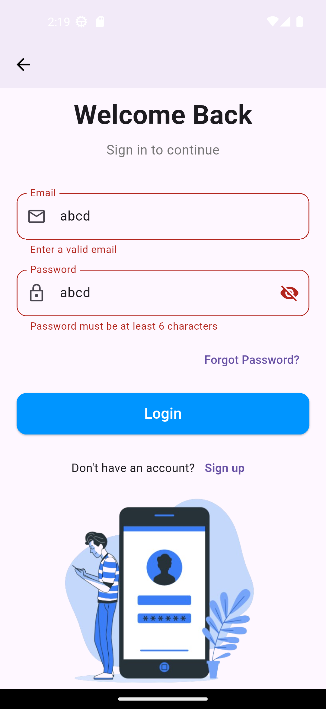
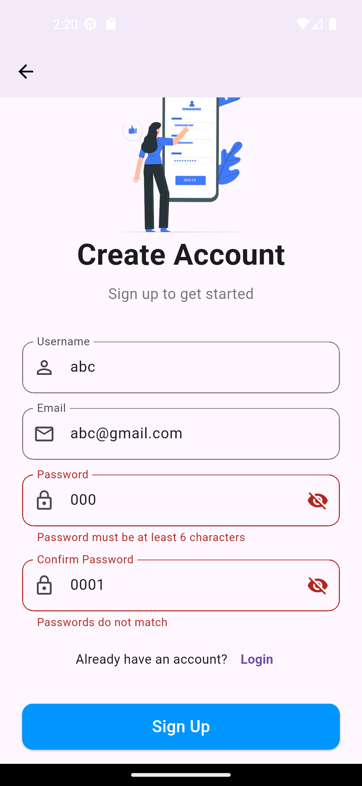

# 📱 Flutter Login & Signup UI

<div align="center">


A beautiful, modern, and fully responsive **Login & Signup UI** built with Flutter. Perfect for starting your next Flutter project with a polished authentication flow! ✨

[Features](#features) • [Screenshots](#screenshots) • [Installation](#installation) • [Usage](#usage) • [Contributing](#contributing)

</div>

---

## 🌟 Features

| Feature | Description |
|---------|-------------|
| ✅ **Modern UI Design** | Clean and attractive interface with smooth animations |
| ✅ **Form Validation** | Real-time validation for email, password, and username fields |
| ✅ **Password Visibility Toggle** | Show/hide password with eye icon |
| ✅ **Loading States** | Animated loading indicators on buttons |
| ✅ **Responsive Layout** | Works perfectly on mobile, tablet, and web |
| ✅ **Navigation Flow** | Smooth transitions between Welcome, Login, and Signup screens |
| ✅ **Asset Images** | Placeholder images included (replace with your own) |
| ✅ **Null Safety** | Fully migrated to Dart null safety |

---

## 📸 Screenshots

<div align="center">

| Welcome Screen | Login Screen | Signup Screen |
|:--------------:|:------------:|:-------------:|
|  |  |  |

</div>

> **Note:** Replace the placeholder images in the `assets/` folder with your own illustrations!

---

## 🚀 Installation

### Prerequisites

- [Flutter](https://flutter.dev/docs/get-started/install) (version 3.10 or higher)
- [Dart](https://dart.dev/get-dart) (version 3.0 or higher)
- An IDE (VS Code, Android Studio, or IntelliJ)

### Steps

1. **Clone the repository**
   ```bash
   git clone https://github.com/yourusername/flutter-login-signup-ui.git
   ```

2. **Navigate to the project directory**
   ```bash
   cd flutter-login-signup-ui
   ```

3. **Install dependencies**
   ```bash
   flutter pub get
   ```

4. **Run the app**
   ```bash
   flutter run
   ```

---

## 📂 Project Structure

```
lib/
├── main.dart           # Welcome screen with navigation
├── login.dart          # Login screen with form validation
└── signup.dart         # Signup screen with form validation

assets/
├── welcome.png         # Welcome screen illustration
└── background.png      # Background image for login/signup

pubspec.yaml            # Project configuration
README.md               # Project documentation
```

---

## 🎨 Customization

### Change Colors

Edit the primary color in the button styles:

```dart
backgroundColor: const Color(0xff0095FF)  // Change this hex value
```

### Add New Images

1. Add your images to the `assets/` folder
2. Update `pubspec.yaml`:
   ```yaml
   assets:
     - assets/your-new-image.png
   ```
3. Use in your code:
   ```dart
   Image.asset('assets/your-new-image.png')
   ```

## 📱 Usage

### Welcome Screen (`main.dart`)

The entry point of the app with two main buttons:
- **Login** → Navigates to LoginPage
- **Sign up** → Navigates to SignupPage

### Login Screen (`login.dart`)

Features:
- Email validation (format checking)
- Password validation (minimum 6 characters)
- Password visibility toggle
- "Forgot Password?" placeholder
- "Don't have an account?" link to Signup
- Loading animation on submit

### Signup Screen (`signup.dart`)

Features:
- Username validation (minimum 3 characters)
- Email validation
- Password validation (minimum 6 characters)
- Confirm password matching
- Password visibility toggles
- "Already have an account?" link to Login
- Loading animation on submit

---

<div align="center">

### ⭐ Star this repository if you found it useful!

Made with ❤️ and Flutter

</div>